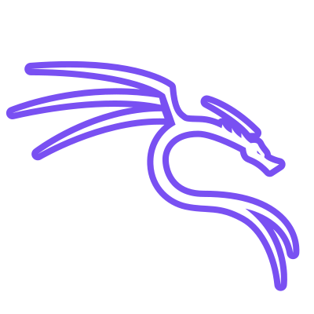

# TacosConChelas (Adriel)

- I like to learn about new technologies, but I'm just a beginner learning
<!---
TacosConChelas/TacosConChelas is a ✨ special ✨ repository because its `README.md` (this file) appears on your GitHub profile.
You can click the Preview link to take a look at your changes.
--->

## <picture></picture> About me

       

 

   
  <li>👋 Console.log("Hi Everyone"); jajajj My name is Adriel (TacosConChelas), I'm from Mexico and I'm 20 years old. Some people call me "Chelas" and others call me "Adri".</li>
  <li>👀 I'm interested in programming but I am still a beginner. In addition to being interested in Cybersecurity.</li>
  <li>🌱 I'm currently learning a little JS and Java.</li>
  <li>💞️ I'm looking to collaborate on some game development or application development.</li>
  <li>📫 How to reach me you could send me a message to my instagram "Tacos_Con_Chelas".</li>

¡Click here!

## My Achievements

  
  

## <picture></picture> Programming languages

   
  

 

### Others

  
   

## <picture></picture> OS 

### Most used OS

   
  
  

### FEDORA lover ❤️

  

### Others

  
  
  
  

## <picture></picture> IDEs

  
  
  
  

## Other tools

  
  
  
  
  
  
  

  

## <picture>   </picture>  Github Stats
<!--- https://streak-stats.demolab.com/demo/ -->

  

---

  <!--    https://github-readme-stats.vercel.app/api?username=TacosConChelas&theme=shadow_red&show_icons=tru --->
 
  
  
  

## Favorite repositories
 <!--   https://github-readme-stats.vercel.app/api?username=TacosConChelas&theme=shadow_red&show_icons=true   --->

  

    
    
    
  

  

<!--- snake -->

  </a>

<!-- inspiración para las estadisticas: 
https://github.com/anuraghazra/github-readme-stats
https://streak-stats.demolab.com/demo/?user=TacosConChelas&theme=onedark&hide_border=true&border_radius=4.5&locale=en&date_format=j+M%5B+Y%5D&mode=daily&exclude_days=&sections=total%2Ccurrent%2Clongest&card_width=495&type=png&background-type=solid&properties=border&fire=%23FF1000&ring=%23FF0000&background=%23000000FF&sideNums=%23FF0000&currStreakLabel=%23EBEBEB&currStreakNum=%23C5C5C5&dates=%23A91414
https://streak-stats.demolab.com/demo/
https://desarrolloweb.com/articulos/600.php
https://www.aulafacil.com/cursos/crear-paginas-web/html/enlazar-una-imagen-l19280
https://www.remove.bg/es/upload
--->

